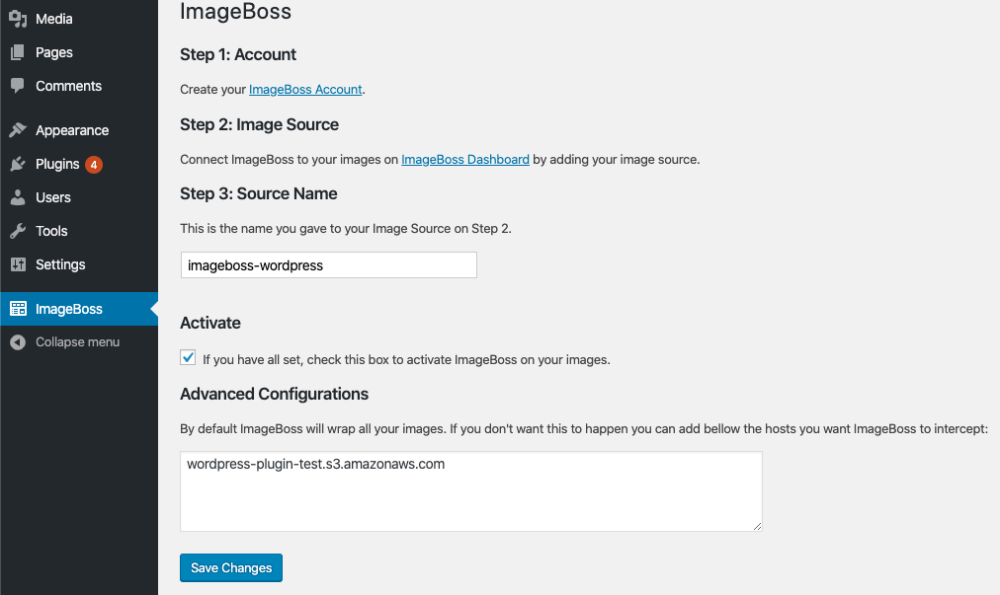
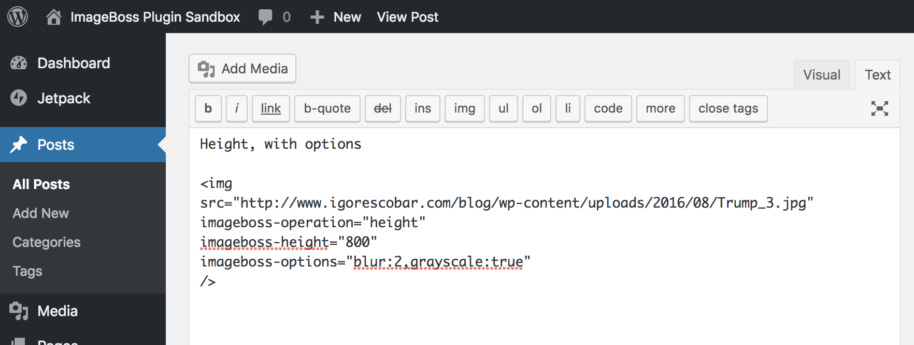

# ImageBoss Plugin for Wordpress

Official Wordpress plugin for ImageBoss.
[https://imageboss.me/](https://imageboss.me/)

# Plugin Features
* WooCommerce Compatible.
* Compression, CDN and progressive scans to all your images AUTOMATICALLY.
* Free Bandwidth.
* Retina Displays Support.
* Theme Images Supported.
* Post Images Supported.
* Helper for inserting images into your posts using ImageBoss Functionalities.

This plugin allows you to automatically serve all your image files via ImageBoss service which will give you:
* Content Aware Image Cropping.
* Up to 60% smaller images.
* WebP Detection.
* Face Detection.
* Animated GIFs.
* Progressive Scans.
* Image CDN.
* Image Filters.
* Watermarking.

## Manual Installation
Installing "ImageBoss WordPress Plugin" can be done either by searching for "ImageBoss" via the "Plugins > Add New" screen in your WordPress dashboard, or by using the following steps:

1. Download the plugin via [WordPress.org Plugins](https://wordpress.org/plugins/imageboss)
2. Upload the ZIP file through the 'Plugins > Add New > Upload' screen in your WordPress dashboard
3. Activate the plugin through the 'Plugins' menu in WordPress
4. If you have any plugin like WP-Cache, please, clean up your cache after the installation or any updates with your templates.

## Setting Up

### Authorise your traffic
When you install go to the settings menu: Dashboard -> ImageBoss -> Settings. Make sure you follow all the steps.

## Usage

### Default Behaviour
When you activated and configured your plugin. We will automatically handle all your images and apply CDN, Compression, Retina Displays Detection, WebP Support, Progressive scans etc.

### Customizing output
If you want, you can edit your `img` tag and add ImageBoss specific attributes to customize the output of your images:

You can do the same with on your themes:

Full list of options available can be found <a href="https://github.com/imageboss/imageboss-web#usage">here</a>.

## Tested on
WordPress
  - 4.9.x
  - 5.2.x
  - 5.3.x
